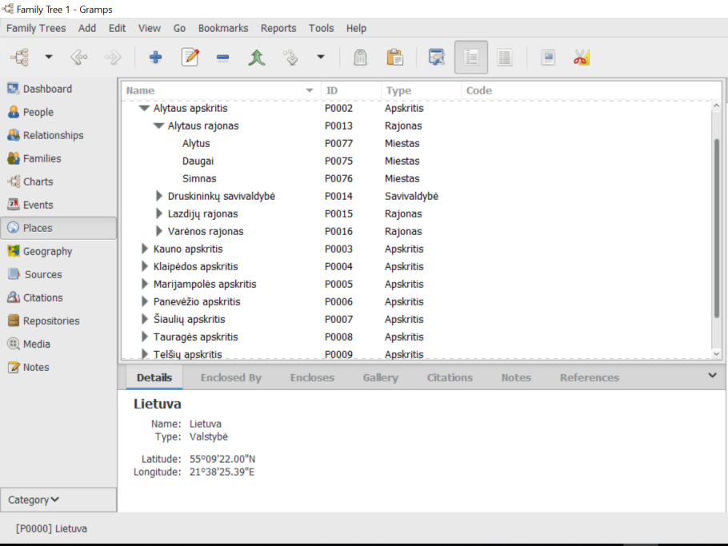
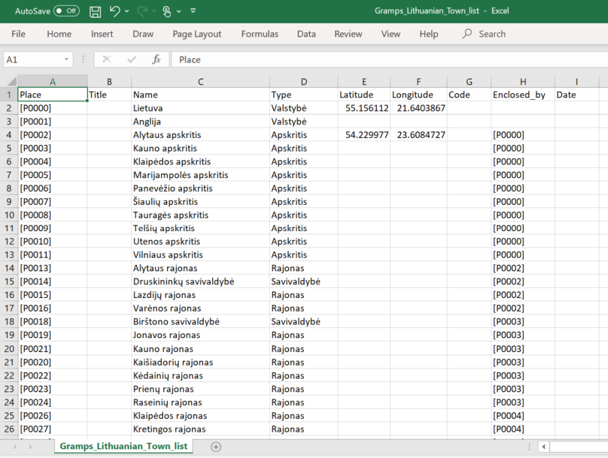

County, district and town list in Lithuania country .CSV file to import in to Gramps family tree software. All in Lithuanian language and to be used for Lithuanians.

### Lietuvos apskričių, rajonų ir savivaldybių taip pat ir miestų sąrašas importavimui į Gramps. 

Suvedinėjant giminės medį į Gramps vis riekia įvesti naują miestą ar nauja rajoną ir tada gaunasi bardakas nes struktūriškai paskui labai sunku sutvarkyti. Importavus sąrašą beliks tik pasirinkti iš jo. Sąraše nėra kaimelių bei mažų gyvenviečių, bet juo labai paprasta bus įvesti patiems. Įvedinėjant naują gyvenvietę reikia pažymėti rajoną kuriame ji yra ir tada pridėti naują.

##### Kaip naudoti:

Paprasčiausiai importuoti į Gramps programą šį failą *GrampsLithuanianTown_list.CSV* failą.

##### Pastaba: 

Siūlau pasidaryti pagrindinės duombazės kopiją ir iš pradžių bandyti importuoti į ją, kad suprasti kaip Gramps reaguos su jau jūsų esamomis vietovėmis prieš importuojant į pagrindinę duombazę.

##### Koordinatės:

Pabandymui įrašiau geografines koordinates bet surašyti visiems miestams labai daug rankinio darbo, jei kas žinote kur gauti visų miestų koordinates trejų stulpelių sąraše tada galim būtų bandyti papildyti. 

##### Klaidos: 

Jei pastebėjote klaidų ar turite patarimų, pašau pasidalinkite. 

##### Screenshotai:

